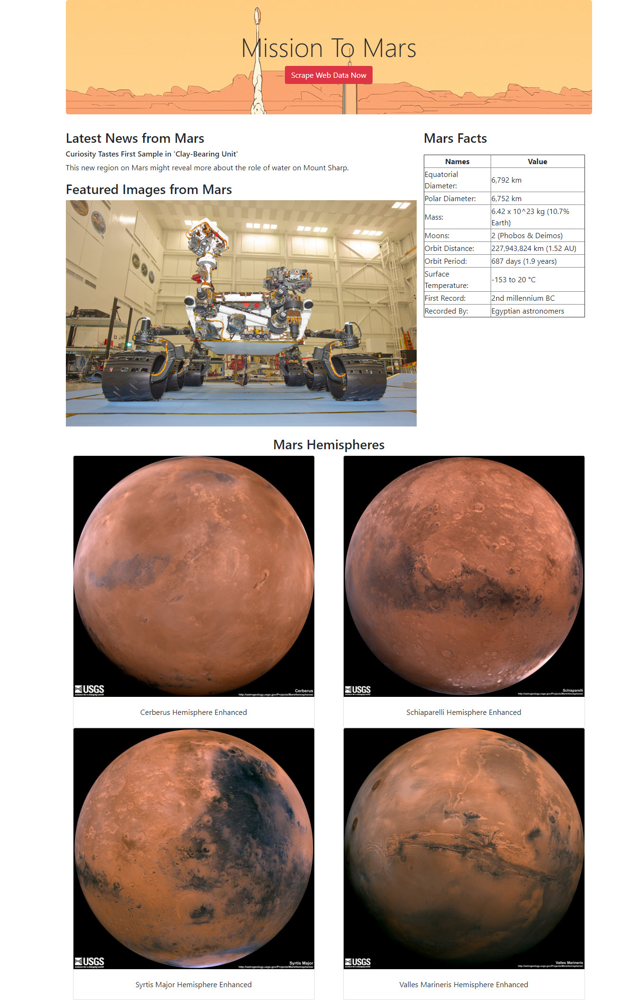

# Python-Web-Scrapping-Project - Mission to Mars
This project utilizing two set of Python tools/libraries - Beautiful Soup and Splinter to comb through web pages for data. Then using Flask web framework/server to generate a new page that contains mars facts, data, and weather inforamtion.

### Section 1: Scrapping Data using Jupyter Notebook
#### Scrapping Tasks:
1. NASA News Headline
2. JPL Mars Space Image - Featured Image
3. Mars Weather - from Twitter
4. Mars Facts - data table
5. Mars hemispheres - full size images of Mar's hemisphers

### Section 2: Building a Flask based web application
#### MongoDB / Flask
1. MongoDB is currently hosted locally at port 12701
2. Two python files were generated - app.py and scrape_mars.py

#### Here is the screenshot of the page generated:

